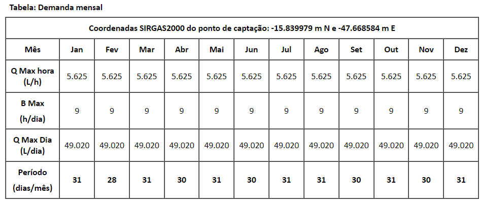

# RJS - Drainage


## User Interface

### Responsividade

Para desktop o mapa fica do lado esquerdo e as tabs (busca, superficial, subterrâneo) do lado direito. No tamanho de celular o mapa fica acima e as tabs (Mapa, Superficial e Subterrâneo) ficam abaixo do mapa. <br><br>
  
#### Desktop
A tabela de outorgas fica abaixo aos items mapa e tabs, que estão lado a lado:
  
| MAPA   | BUSCAR | SUPERFICIAL | SUBTERRANEO |
|---|---|---|---|
|        |        |             |             |
| TABELA |
  
#### Celular
A tabela com a lista de outorgas fica abaixo aos items mapa e tabs que estão um abaixo do outro: <br><br>
    
| MAPA   |             |             |
|---|---|---|
| GERAL  | SUPERFICIAL | SUBTERRANEO |
| TABELA |


### Modo Noturno
    - Salvar a escolha no navegador
    - O texto das tabs está sumindo no modo noturno

## Calculos de Vazão



 ```
  [jan-dez] vazao_lh -> vazão (l/h)

  [jan-dez] vazao_mh -> vazão jan-dez (m³/h) -> FÓRMULA: vazao_lh/1000

  [jan-dez] tempo_h  tempo de bombeamento (h)

  [jan-dez] vol_max_md -> vol max dia (m³/dia) -> FÓRMULA: vazao_mh * tempo_h

  [jan-dez] periodo_dm -> periodo (dias/mês)

  [jan-dez] vol_m_mm -> vol mensal (m³/mês) -> FORMULA: vazao_mh * tempo_h * periodo_dm

  valores únicos:

  vol_a_ma -> somatorio vol_m_mm -> Volume Anual Requerido (m³/ano)	Código	Vazão Explotável (m³/ano)

  valores do codigo

	Vazão Explotável (m³/ano)
	N° Poços - Incluindo este ato	
	Vazão Total Outorgada por Código - Incluindo a outorga deste ato (m³/ano)	
	% UTILIZADA	Volume Disponível Atual para Outorga (m³/ano)
	Volume Disponível é suficiente para atender a este ato de outorga? sim ou não

  */
 
 ```
 

 ## JSON

 ### Dados do banco
 ```
		"us_nome":"ERALDO XXXXXXX CAMPOS",
    "us_cpf_cnpj":"008XXXX77662",
    
		"emp_id":61762,"emp_endereco":"DF-130, NÚCLEO XXXXXXXX, CHÁCARA XX",
   
		"int_processo":"197XXX751/2017",
			"int_id":6780,"int_num_ato":"650/2017",
			"int_latitude":-15.83367,
			"int_longitude":-47.658903,
			"int_shape":{"type":"Point","coordinates":[-47.65890336199993,-15.833669855999972]},
    
		"ti_id":2,"ti_descricao":"SUBTERRANEA",
    
		"sp_id":3,"sp_descricao":"VENCIDA",
    
		"tp_id":2,"tp_descricao":"TUBULAR   ",
    
		"bh_id":4,"bh_nome":"Rio São Bartolomeu",
    
		"uh_id":27,"uh_nome":"Baixo Rio São Bartolomeu",

		"geo_codigo":"016_06_F",			

  DEMANDA

		"dt_demanda":{"demandas":[
			{
				"id_demanda_total":["68198996"],
				"id_interferencia":["6780"],
				"vazao_hora":["5625.00"],   ---> LITROS POR HORA
				"vazao_dia":["112500.00"],  ---> LITROS POR DIA
				"qt_dias":["31"],			---> DIAS MÊS
				"tempo_captacao":["20"],	---> HORA DIA
				"mes":["1"]},
			(...)
 ```
 

### Planilha de Demanda Outorgada Para Captação Subterrânea

 ```
[
    {
        "Número do Processo": "197XXXX2396/2019",
        "Nome do Usuário": "CARMEM LUCIA XXXXX CAVALCANTE",
        "Tipo de Outorga": "OUTORGA DE DIREITO DE USO",
        "Número do Ato": "019/2020",
        "Situação": "OUTORGADO",
        "Tipo do Poço": "TUBULAR",
        "Bacia": "RIO PARANOÁ",
        "UH": "9",
        "Subsistema": "R3/Q3",
        "Código": "023_09_R3/Q3",
        "Vazão Anual (L/ano)": "109500",
        "Vazão Anual (m³/ano)": "109,05",
        "Vazão Máxima (L/h)": "300"
    }
]
 ```

| Número do Processo | Nome do Usuário| Tipo de Outorga| Número do Ato | Situação  | Tipo do Poço | Bacia| UH | Subsistema | Código| Vazão Anual (L/ano) | Vazão Anual (m³/ano) | Vazão Máxima (L/h) |
|---|---|---|---|---|---|---|---|---|---|---|---|---|
| 1970000XXX/2019   | CARMEM LUCIA XXXXXX CAVALCANTE | OUTORGA DE DIREITO DE USO | 019/2020| OUTORGADO | TUBULAR      | RIO PARANOÁ | 9  | R3/Q3      | 023_09_R3/Q3 | 109500| 109,05| 300 |


### Dados de disponibilidade
``` 
{
  "Volume Anual Requerido (m³/ano)": "0",
  "Código": "",
  "Vazão Explotável (m³/ano)": "",  /* ver Código e vazão do subsistema */
  "N° Poços - Incluindo este ato": "",
  "Vazão Total Outorgada por Código - Incluindo a outorga deste ato (m³/ano)": "",
  "% UTILIZADA": "",
  "Volume Disponível Atual para Outorga (m³/ano)": "",
  "Volume Disponível é suficiente para atender a este ato de outorga?": "SIM"
}
```

### Colocar uma planilha com os dados seguintes:

```
[
    {
        "Volume mensal Janeiro (m³/mês)": "0,0",
        "Volume mensal Fevereiro (m³/mês)": "0,0",
        "Volume mensal Março (m³/mês)": "0,0",
        "Volume mensal Abril (m³/mês)": "0,0",
        "Volume mensal Maio (m³/mês)": "0,0",
        "Volume mensal Junho (m³/mês)": "0,0",
        "Volume mensal Julho (m³/mês)": "0,0",
        "Volume mensal Agosto (m³/mês)": "0,0",
        "Volume mensal Setembro (m³/mês)": "0,0",
        "Volume mensal Outubro (m³/mês)": "0,0",
        "Volume mensal Novembro (m³/mês)": "0,0",
        "Volume mensal Dezembro (m³/mês)": "0,0"
    }
]
```
| Volume mensal Janeiro (m³/mês) | Volume mensal Fevereiro (m³/mês) | Volume mensal Março (m³/mês) | Volume mensal Abril (m³/mês) | Volume mensal Maio (m³/mês) | Volume mensal Junho (m³/mês) | Volume mensal Julho (m³/mês) | Volume mensal Agosto (m³/mês) | Volume mensal Setembro (m³/mês) | Volume mensal Outubro (m³/mês) | Volume mensal Novembro (m³/mês) | Volume mensal Dezembro (m³/mês) |
|---|---|---|---|---|---|---|---|---|---|---|---|
| 0,0| 0,0| 0,0| 0,0| 0,0| 0,0| 0,0| 0,0|0,0|0,0| 0,0| 0,0|


### Links

[json to jsonschema](https://transform.tools/json-to-json-schema)

[html to json](https://www.prowaretech.com/articles/current/tools/convert-html-to-json#!)

[converter excel-json-markdown](https://tableconvert.com/json-to-markdown)


 27/01/2023

 1 - Adicionar um speaddeal no mapa para opções como exportar excel etc.<br>
 [spead deal](https://mui.com/material-ui/react-speed-dial/)
 

### Temas estudados: <br>

[jellywp](https://jellywp.com/wp/wesper6/home-page-3/#)

[city book](http://preview.themeforest.net/item/citybook-directory-listing-template/full_screen_preview/21360333)

### Cores
[image color picker](https://imagecolorpicker.com/)

[react chart - 2 - example](https://codesandbox.io/s/vlhbl?file=/src/components/CustomCharts.js:424-425)

### react - material - tailwind
[material ui com tailwind](https://www.youtube.com/watch?v=QQIfuMlA6TI)

### Converter excel em markdown
[table convert](https://tableconvert.com/)